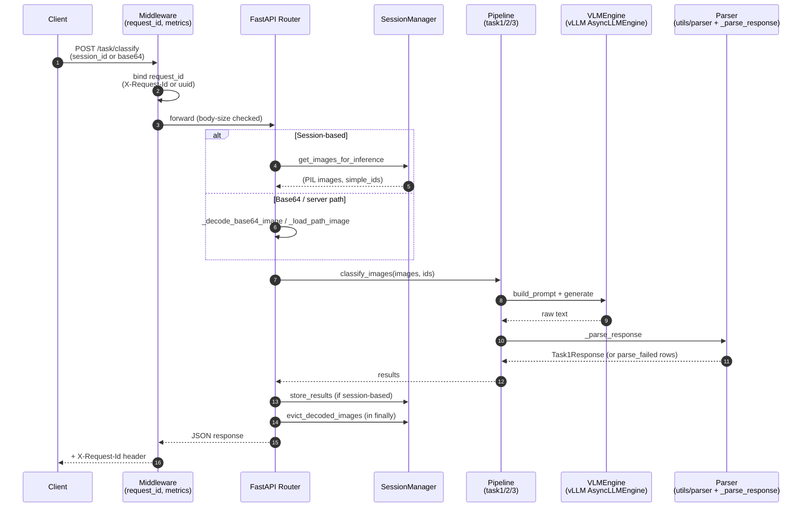

# Architecture

## One-paragraph mental model

A FastAPI process owns a single `AsyncLLMEngine` (vLLM) and a
`SessionManager`. Clients either (a) post base64 images inline for
stateless inference, or (b) create a session, upload images to it, and
run tasks by reference. All three tasks (classification, attribute
extraction, pair validation) share the engine; task-specific logic
lives in `app/pipelines/*` as thin wrappers that build a prompt, call
`engine.generate`, and parse the response into Pydantic result types.

## Request flow

## Key invariants

- **One engine, one process.** Module-level singleton in
  `app/engine.py`. Request IDs are drawn from `itertools.count` so
  concurrent coroutines cannot collide.
- **Sessions own disk + memory.** `SessionManager` writes uploads to
  `$SESSION_TEMP_DIR/<session_id>/` and decodes PIL handles lazily. An
  `inference_window()` async context evicts decoded frames on exit so
  the 24-hour TTL does not pin ~48 MB/image.
- **No fabricated outputs.** Parsers return `parse_failed=True` with
  `error="..."` rather than defaults. `category=None` and
  `confidence=None` are load-bearing — downstream code MUST branch on
  `error is None`, never on sentinel strings like `"unknown"` or
  middle-ground values like `0.5`.
- **Strict identity matching in Task 1.** The response parser matches
  model-returned keys to requested image IDs by exact or basename
  equality only. There is no positional fallback — a missing key yields
  a `parse_failed` row, never a silently mis-labeled one.

## Why the boundaries are where they are

- **Pipeline ↔ Engine** — so a new task is "write a prompt + a parser,"
  not "rewire inference." Task code never touches sampling params or
  request IDs; the engine owns retries and backoff.
- **Engine ↔ Parser** — so swapping vLLM for another backend (TGI,
  TensorRT-LLM) only touches `app/engine.py`. Parsers consume strings.
- **SessionManager ↔ Routes** — so a stateless endpoint and a
  session-based endpoint share one decode path (`_decode_rgb`) with a
  bounded semaphore. Decode concurrency is a single tunable
  (`IMAGE_DECODE_WORKERS`), not ten copies of `asyncio.to_thread`.

## Observability touchpoints

- `request_id` — generated or honoured from `X-Request-Id`, echoed in
  every response, bound into a `contextvars.ContextVar` so every log
  line (including from pipeline modules) carries it automatically.
- Prometheus — `/metrics` exposes `http_requests_total`,
  `http_request_duration_seconds`, `http_inflight_requests`.
- `/healthz` vs `/readyz` — liveness never touches the engine;
  readiness returns 503 while the engine is warming or the GPU is
  unreachable, draining the pod from the load balancer without a
  SIGKILL.

## What this architecture intentionally does NOT do (yet)

- **Multi-replica sessions.** `SessionManager` is in-process. Scaling
  horizontally requires moving session state to Redis or similar.
- **Engine supervision / auto-restart.** A hung vLLM engine will fail
  `/readyz` (so traffic drains) but will not auto-recover. Restart is
  manual / K8s-level today.
- **Per-request SamplingParams overrides.** Sampling is server-chosen.
  Adding client control requires a capped override path — see runbook
  for the security rationale.
